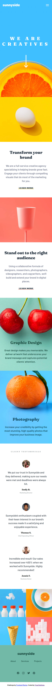
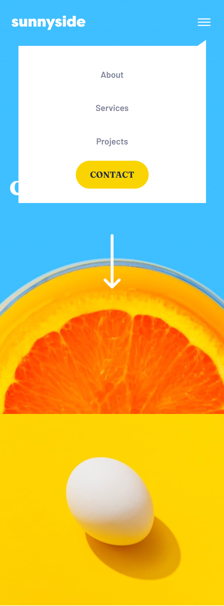

# Frontend Mentor - Sunnyside agency landing page solution

This is a solution to the [Sunnyside agency landing page challenge on Frontend Mentor](https://www.frontendmentor.io/challenges/sunnyside-agency-landing-page-7yVs3B6ef). Frontend Mentor challenges help you improve your coding skills by building realistic projects.

## Table of contents

- [Overview](#overview)
  - [The challenge](#the-challenge)
  - [Screenshot](#screenshot)
  - [Links](#links)
- [My process](#my-process)
  - [Built with](#built-with)
  - [Continued development](#continued-development)
  - [Useful resources](#useful-resources)
- [Author](#author)
- [Acknowledgments](#acknowledgments)

**Note: Delete this note and update the table of contents based on what sections you keep.**

## Overview

### The challenge

Users should be able to:

- View the optimal layout for the site depending on their device's screen size
- See hover states for all interactive elements on the page

### Screenshot

### Links

- Solution URL: (https://github.com/ygabdn29/sunnyside-landing-page)
- Live Site URL: (https://ygabdn29.github.io/sunnyside-landing-page/)

## My process

### Built with

- HTML5 markup
- CSS custom properties
- Flexbox
- CSS Grid
- Vanilla Javascript

### Continued development

- Adding more breakpoints so the design stays consistent in wider array of screen sizes
- Some spacing and color could be more accurate to the design

### Useful resources

- [CSS-Tricks](https://css-tricks.com/snippets/css/complete-guide-grid/) - Guide for Grid
- [CSS-Tricks](https://css-tricks.com/snippets/css/a-guide-to-flexbox/) - Guide for Flexbox
- [MDN](https://developer.mozilla.org/en-US/)

## Author

- Yoga Budiman

## Acknowledgments

- (https://codepen.io/lzl124631x/pen/PZOogp) - For styling the mobile menu, I'm taking the code from Richard Liu's bubble dropdown menu and then modified it. It really helped me.
